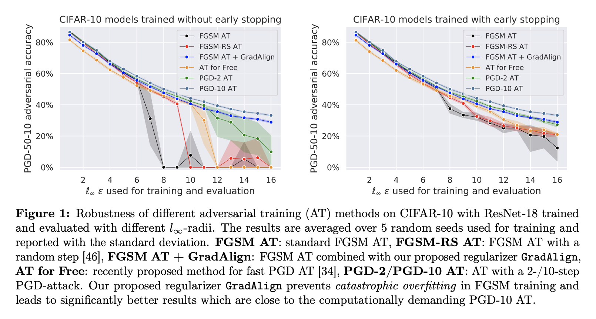
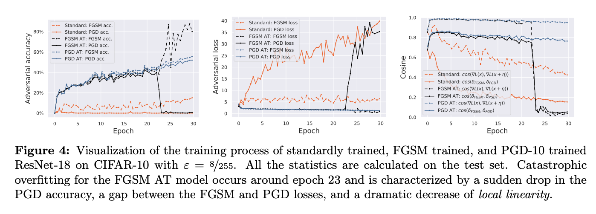
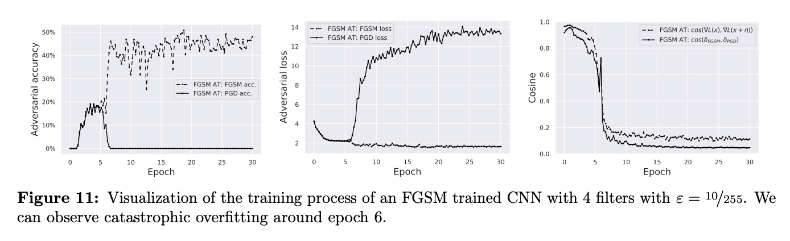
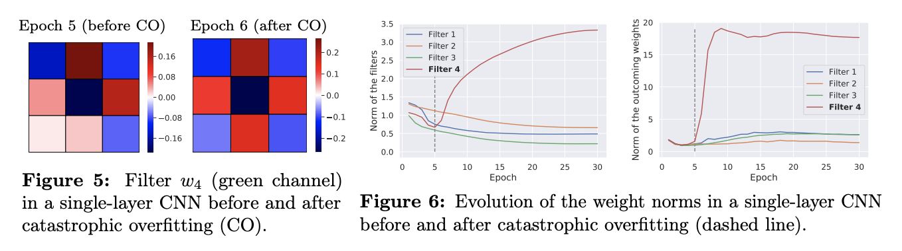
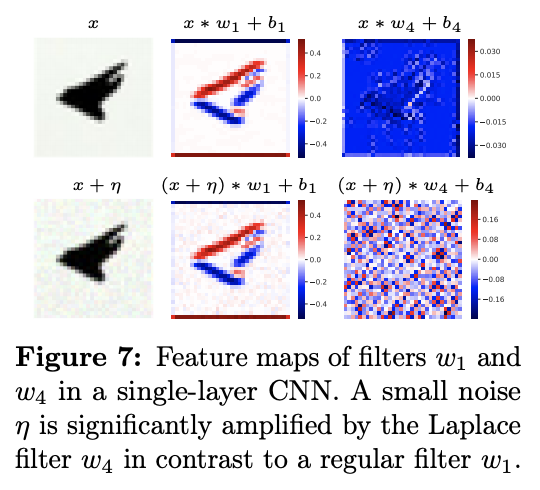
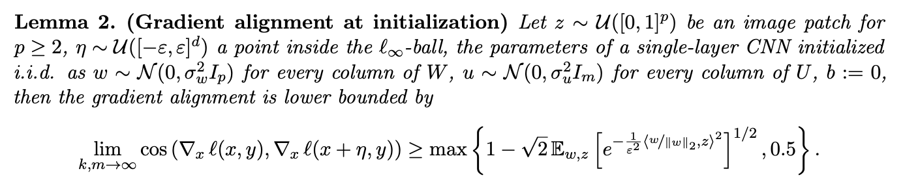
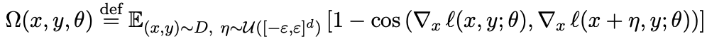
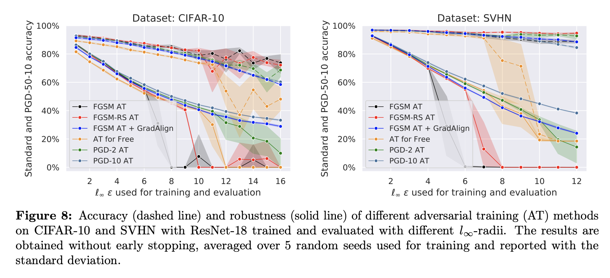

# Understanding and Improving Fast Adversarial Training

**Maksym Andriushchenko (EPFL), Nicolas Flammarion (EPFL)**

**Paper:** [https://arxiv.org/abs/2007.02617](https://arxiv.org/abs/2007.02617)

## Abstract
A recent line of work focused on making adversarial training computationally efficient for deep learning models. 
In particular, Wong et al. (2020) showed that Linf-adversarial training with fast gradient sign method (FGSM) can fail 
due to a phenomenon called "catastrophic overfitting", when the model quickly loses its robustness over a single epoch 
of training. We show that adding a random step to FGSM, as proposed in Wong et al. (2020), does not prevent catastrophic 
overfitting, and that randomness is not important per se -- its main role being simply to reduce the magnitude of the 
perturbation. Moreover, we show that catastrophic overfitting is not inherent to deep and overparametrized networks, 
but can occur in a single-layer convolutional network with a few filters. In an extreme case, even a single filter can 
make the network highly non-linear locally, which is the main reason why FGSM training fails. Based on this observation, 
we propose a new regularization method, GradAlign, that prevents catastrophic overfitting by explicitly maximizing the 
gradient alignment inside the perturbation set and improves the quality of the FGSM solution. As a result, GradAlign 
allows to successfully apply FGSM training also for larger Linf-perturbations and reduce the gap to multi-step adversarial 
training.

## About the paper
We first show that not only FGSM training is prone to catastrophic overfitting, but the recently proposed fast 
adversarial training methods [34, 46] as well (see Fig. 1). 

We crucially observe that after catastrophic overfitting not just FGSM and PGD directions become misaligned, but even
gradients at two **random** points inside the Linf-ball (see the **right** plot).

Surprisingly, this phenomenon is not inherent to deep and overparametrized networks, but can be 
observed even in a single-layer CNN. We analyze this setting both empirically and theoretically:

The important property of FGSM training is that standard weight initialization schemes ensure high 
gradient alignment at the beginning of the training. We observe this empirically both in shallow
and deep networks, and formalize it for a single-layer CNN in the following lemma:

The high gradient alignment at initialization implies that at least at the beginning of the training,
FGSM solves the inner maximization problem accurately. However, this may change during training if the 
step size of FGSM is too large.

The importance of gradient alignment motivates our regularizer that aims to increase the gradient alignment. 

It prevents catastrophic overfitting even for large Linf-perturbations and reduces the gap to multi-step adversarial training:

## Code 
`python train.py`
